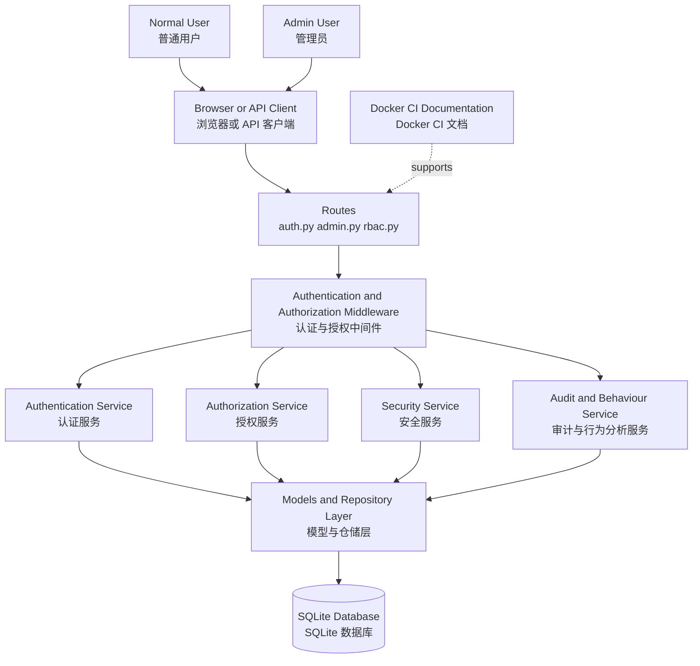

# SecureAccessAI Bilingual Architecture Overview

This document provides a quick bilingual architecture overview for explanation, presentation, and assessment use.

## High-Level View

## Short Explanation

- The project is a layered Flask backend for secure access management.
- Requests enter through routes, pass authentication and authorization middleware, and then flow into service classes.
- The service layer handles authentication, RBAC, security monitoring, and audit/risk summary logic.
- Models and repositories persist business entities and security records into the database.
- Docker, CI, and documentation support reproducibility and delivery.

## Quick Chinese Summary

- 这个项目本质上是一个分层的 Flask 安全访问控制后端。
- 请求先进入路由层，再经过认证和授权中间件，然后交给不同服务模块处理。
- 服务层负责认证、RBAC、安全监测、审计日志和风险摘要。
- 最终由模型和数据库层保存用户、角色、会话和安全事件等数据。

## Request Flow Steps

1. The client sends a request to the Flask API.
2. Authentication middleware validates the token when required.
3. Authorization middleware checks the required permission for protected routes.
4. Service classes apply business logic and security rules.
5. Models and repositories persist the resulting records into the database.
