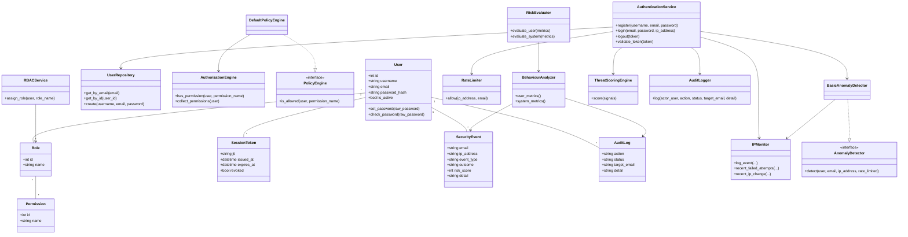

# Final UML Class Diagram (SP1 - SP4)

```mermaid
classDiagram
    class User {
      +int id
      +string username
      +string email
      +string password_hash
      +bool is_active
      +set_password(raw_password)
      +check_password(raw_password)
    }

    class Role {
      +int id
      +string name
    }

    class Permission {
      +int id
      +string name
    }

    class SessionToken {
      +string jti
      +datetime issued_at
      +datetime expires_at
      +bool revoked
    }

    class SecurityEvent {
      +string email
      +string ip_address
      +string event_type
      +string outcome
      +int risk_score
      +string detail
    }

    class AuditLog {
      +string action
      +string status
      +string target_email
      +string detail
    }

    class UserRepository {
      +get_by_email(email)
      +get_by_id(user_id)
      +create(username, email, password)
    }

    class AuthenticationService {
      +register(username, email, password)
      +login(email, password, ip_address)
      +logout(token)
      +validate_token(token)
    }

    class AuthorizationEngine {
      +has_permission(user, permission_name)
      +collect_permissions(user)
    }

    class PolicyEngine {
      <<interface>>
      +is_allowed(user, permission_name)
    }

    class DefaultPolicyEngine

    class RBACService {
      +assign_role(user, role_name)
    }

    class IPMonitor {
      +log_event(...)
      +recent_failed_attempts(...)
      +recent_ip_change(...)
    }

    class RateLimiter {
      +allow(ip_address, email)
    }

    class AnomalyDetector {
      <<interface>>
      +detect(user, email, ip_address, rate_limited)
    }

    class BasicAnomalyDetector

    class ThreatScoringEngine {
      +score(signals)
    }

    class AuditLogger {
      +log(actor_user, action, status, target_email, detail)
    }

    class BehaviourAnalyzer {
      +user_metrics()
      +system_metrics()
    }

    class RiskEvaluator {
      +evaluate_user(metrics)
      +evaluate_system(metrics)
    }

    User "*" -- "*" Role
    Role "*" -- "*" Permission
    User "1" -- "*" SessionToken
    User "1" -- "*" SecurityEvent
    User "1" -- "*" AuditLog
    AuthenticationService --> UserRepository
    AuthenticationService --> AuditLogger
    AuthenticationService --> IPMonitor
    AuthenticationService --> RateLimiter
    AuthenticationService --> BasicAnomalyDetector
    AuthenticationService --> ThreatScoringEngine
    DefaultPolicyEngine ..|> PolicyEngine
    DefaultPolicyEngine --> AuthorizationEngine
    RBACService --> Role
    BasicAnomalyDetector ..|> AnomalyDetector
    BasicAnomalyDetector --> IPMonitor
    BehaviourAnalyzer --> SecurityEvent
    BehaviourAnalyzer --> AuditLog
    RiskEvaluator --> BehaviourAnalyzer
```
