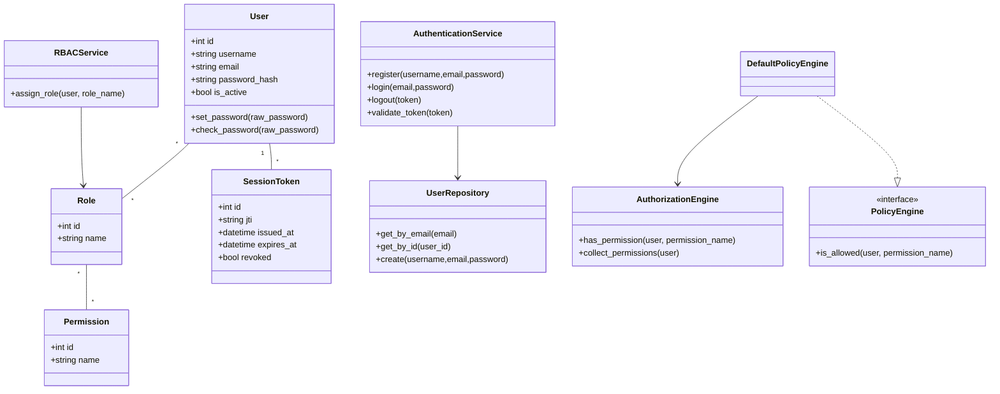

# SP1 + SP2 UML Class Diagram (Mermaid)

```mermaid
classDiagram
    class User {
      +int id
      +string username
      +string email
      +string password_hash
      +bool is_active
      +set_password(raw_password)
      +check_password(raw_password)
    }

    class Role {
      +int id
      +string name
    }

    class Permission {
      +int id
      +string name
    }

    class SessionToken {
      +int id
      +string jti
      +datetime issued_at
      +datetime expires_at
      +bool revoked
    }

    class UserRepository {
      +get_by_email(email)
      +get_by_id(user_id)
      +create(username,email,password)
    }

    class AuthenticationService {
      +register(username,email,password)
      +login(email,password)
      +logout(token)
      +validate_token(token)
    }

    class AuthorizationEngine {
      +has_permission(user, permission_name)
      +collect_permissions(user)
    }

    class PolicyEngine {
      <<interface>>
      +is_allowed(user, permission_name)
    }

    class DefaultPolicyEngine
    class RBACService {
      +assign_role(user, role_name)
    }

    User "*" -- "*" Role
    Role "*" -- "*" Permission
    User "1" -- "*" SessionToken
    AuthenticationService --> UserRepository
    DefaultPolicyEngine ..|> PolicyEngine
    DefaultPolicyEngine --> AuthorizationEngine
    RBACService --> Role
```
